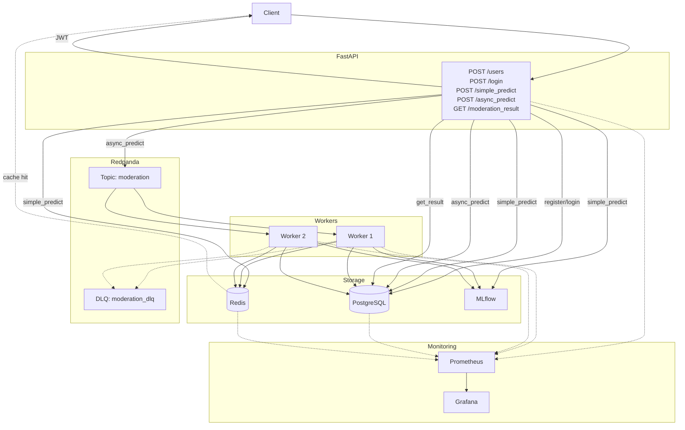

# Ads Moderation Service

Сервис модерации объявлений с использованием ML-модели для определения нарушений. Поддерживает синхронные и асинхронные запросы, кэширование результатов и метрики для мониторинга.

- [Ads Moderation Service](#ads-moderation-service)
  - [Функциональность](#функциональность)
  - [Технологический стек](#технологический-стек)
  - [Архитектура сервиса](#архитектура-сервиса)
  - [Быстрый старт](#быстрый-старт)
    - [Требования](#требования)
    - [Запуск с Docker Compose](#запуск-с-docker-compose)
    - [Переменные окружения](#переменные-окружения)
  - [API Эндпоинты](#api-эндпоинты)
    - [Пользователи](#пользователи)
    - [Модерация](#модерация)
  - [Примеры запросов](#примеры-запросов)
    - [1. Регистрация пользователя](#1-регистрация-пользователя)
    - [2. Авторизация](#2-авторизация)
    - [3. Синхронное предсказание](#3-синхронное-предсказание)
    - [4. Предсказание по ID объявления (с кэшированием)](#4-предсказание-по-id-объявления-с-кэшированием)
    - [5. Асинхронное предсказание](#5-асинхронное-предсказание)
    - [6. Получение результата асинхронной задачи](#6-получение-результата-асинхронной-задачи)
    - [7. Закрытие объявления](#7-закрытие-объявления)
  - [Тестирование](#тестирование)
    - [Установка зависимостей](#установка-зависимостей)
    - [Запуск тестов](#запуск-тестов)
    - [Ручное тестирование](#ручное-тестирование)
  - [Структура проекта](#структура-проекта)
  - [Мониторинг](#мониторинг)
    - [Доступные интерфейсы](#доступные-интерфейсы)
    - [Метрики](#метрики)
  - [Остановка сервисов](#остановка-сервисов)
  - [Демонстрация работы сервиса](#демонстрация-работы-сервиса)

## Функциональность

- **Синхронная модерация** (`/predict`) — мгновенное предсказание по данным объявления
- **Модерация по ID** (`/simple_predict`) — предсказание с кэшированием результатов
- **Асинхронная модерация** (`/async_predict`) — обработка через Kafka для длительных операций
- **Получение результатов** (`/moderation_result/{task_id}`) — проверка статуса асинхронной задачи
- **Закрытие объявлений** (`/close`) — удаление объявления и связанных кэшей
- **Управление пользователями** — регистрация, авторизация (JWT), блокировка, удаление

## Технологический стек

| Компонент | Технология |
|-----------|------------|
| Язык | Python 3.13 |
| Веб-фреймворк | FastAPI |
| Базы данных | PostgreSQL, Redis |
| Очереди сообщений | Apache Kafka (Redpanda) |
| ML-модель | scikit-learn, MLflow |
| Мониторинг | Prometheus, Grafana |
| Тестирование | pytest, pytest-asyncio |
| Контейнеризация | Docker, Docker Compose |

## Архитектура сервиса



## Быстрый старт

### Требования

- Docker и Docker Compose
- Python 3.13 (для локального запуска тестов)

### Запуск с Docker Compose

```bash
# Клонировать репозиторий
git clone <repository-url>
cd ads-moderation

# Запустить все сервисы
docker-compose up -d

# Проверить статус
docker-compose ps
```

Сервисы будут доступны на портах:

| Сервис | URL | Логин/Пароль |
|--------|-----|--------------|
| API | http://localhost:8003 | — |
| Grafana | http://localhost:3000 | admin/admin |
| Prometheus | http://localhost:9090 | — |
| Redpanda Console | http://localhost:8080 | — |

### Переменные окружения

Скопируйте `.env.example` в `.env` и настройте переменные:

| Переменная | Описание | Значение по умолчанию |
|------------|----------|----------------------|
| `USE_MLFLOW` | Включить MLflow | `true` |
| `DB_HOST` | Хост PostgreSQL | `localhost` |
| `DB_PORT` | Порт PostgreSQL | `5432` |
| `REDIS_HOST` | Хост Redis | `redis` |
| `KAFKA_BOOTSTRAP` | Kafka bootstrap сервер | `localhost:9092` |
| `SECRET_KEY` | Секретный ключ для JWT | обязательно изменить! |
| `ACCESS_TOKEN_EXPIRE_MINUTES` | Время жизни токена | `30` |


## API Эндпоинты

### Пользователи

| Метод | Эндпоинт | Описание | Доступ |
|-------|----------|----------|--------|
| POST | `/users/` | Регистрация пользователя | Публичный |
| POST | `/login` | Авторизация (JWT) | Публичный |
| GET | `/users/` | Список пользователей | Требуется JWT |
| GET | `/users/current` | Текущий пользователь | Требуется JWT |
| GET | `/users/{user_id}` | Получить пользователя по ID | Требуется JWT |
| PATCH | `/users/block/{user_id}` | Заблокировать пользователя | Требуется JWT |
| DELETE | `/users/{user_id}` | Удалить пользователя | Требуется JWT |

### Модерация

| Метод | Эндпоинт | Описание | Доступ |
|-------|----------|----------|--------|
| POST | `/predict` | Синхронное предсказание по данным | Требуется JWT |
| POST | `/simple_predict` | Предсказание по ID объявления (с кэшем) | Требуется JWT |
| POST | `/async_predict` | Асинхронное предсказание (Kafka) | Требуется JWT |
| GET | `/moderation_result/{task_id}` | Получить результат асинхронной задачи | Требуется JWT |
| POST | `/close` | Закрыть объявление (очистить кэш) | Требуется JWT |

## Примеры запросов

### 1. Регистрация пользователя

```bash
curl -X POST http://localhost:8003/users/ \
  -H "Content-Type: application/json" \
  -d '{
    "name": "Test User",
    "login": "test@example.com",
    "password": "qwerty123"
  }'
```

### 2. Авторизация

```bash
curl -X POST http://localhost:8003/login \
  -H "Content-Type: application/json" \
  -d '{
    "login": "test@example.com",
    "password": "qwerty123"
  }'
```

### 3. Синхронное предсказание

```bash
curl -X POST http://localhost:8003/predict \
  -H "Authorization: Bearer <token>" \
  -H "Content-Type: application/json" \
  -d '{
    "seller_id": 1,
    "is_verified_seller": true,
    "item_id": 123,
    "name": "iPhone 13",
    "description": "Новый телефон, отличное состояние",
    "category": 5,
    "images_qty": 3
  }'
```

### 4. Предсказание по ID объявления (с кэшированием)

```bash
curl -X POST http://localhost:8003/simple_predict \
  -H "Authorization: Bearer <token>" \
  -H "Content-Type: application/json" \
  -d '{"item_id": 123}'
```

### 5. Асинхронное предсказание

```bash
curl -X POST http://localhost:8003/async_predict \
  -H "Authorization: Bearer <token>" \
  -H "Content-Type: application/json" \
  -d '{"item_id": 123}'
```

### 6. Получение результата асинхронной задачи

```bash
curl -X GET http://localhost:8003/moderation_result/1 \
  -H "Authorization: Bearer <token>"
```

### 7. Закрытие объявления

```bash
curl -X POST http://localhost:8003/close \
  -H "Authorization: Bearer <token>" \
  -H "Content-Type: application/json" \
  -d '{"item_id": 123}'
```

## Тестирование

### Установка зависимостей

```bash
pip install -r requirements.txt
```

### Запуск тестов

| Команда | Описание |
|---------|----------|
| `pytest` | Все тесты |
| `pytest -m unit` | Только юнит-тесты |
| `pytest -m integration` | Только интеграционные тесты |
| `pytest tests/test_redis.py` | Тесты Redis |
| `pytest tests/test_users.py` | Тесты пользователей |
| `pytest --cov=app tests/` | С покрытием кода |

### Ручное тестирование

```bash
# Все ручные тесты
python manual_tests.py all

# Только модерация
python manual_tests.py moderation

# Только пользователи
python manual_tests.py users

# Только Kafka
python manual_tests.py kafka

# Комплексные сценарии
python manual_tests.py flow
```

## Структура проекта

```
ads-moderation/
├── app/
│   ├── clients/              # Клиенты для внешних сервисов
│   │   ├── kafka.py          # Kafka producer/consumer
│   │   ├── postgres.py       # PostgreSQL с пулом соединений
│   │   ├── redis.py          # Redis клиент
│   │   └── settings.py       # Настройки окружения
│   ├── db/migrations/        # SQL миграции
│   │   ├── V001__initial.sql
│   │   └── V002__add_is_closed.sql
│   ├── models/               # Pydantic модели
│   │   ├── ads.py
│   │   ├── token.py
│   │   └── users.py
│   ├── repositories/         # Репозитории (работа с БД и кэшем)
│   │   ├── ads.py
│   │   ├── moderation.py
│   │   ├── prediction.py
│   │   └── users.py
│   ├── routers/              # API эндпоинты
│   │   ├── moderation.py
│   │   ├── users.py
│   │   └── utils.py
│   ├── services/             # Бизнес-логика
│   │   ├── auth.py           # JWT авторизация
│   │   └── users.py          # Управление пользователями
│   ├── workers/              # Фоновые воркеры
│   │   └── moderation_worker.py  # Kafka consumer
│   ├── dependencies.py       # DI зависимости
│   ├── errors.py             # Кастомные исключения
│   ├── main.py               # Точка входа FastAPI
│   └── model.py              # Загрузка ML-модели
├── observability/
│   ├── prometheus/
│   │   └── prometheus.yml    # Конфигурация Prometheus
│   ├── metrics.py            # Метрики для мониторинга
│   └── middleware.py         # Middleware для метрик
├── tests/                    # Тесты
├── manual_tests.py           # Ручные тесты
├── load_test.js              # Скрипт для НТ
├── Makefile                  # Инструкция для воркера
├── docker-compose.yml        # Конфигурация Docker Compose
├── Dockerfile                # Dockerfile для приложения
├── requirements.txt          # Зависимости Python
├── .env.example              # Шаблон .env
├── pytest.ini                # Конфигурация pytest
└── README.md                 # Документация
```

## Мониторинг

### Доступные интерфейсы

| Сервис | URL | Доступ |
|--------|-----|--------|
| MLFlow | http://localhost:5000 | Открытый |
| Prometheus | http://localhost:9090 | Открытый |
| Grafana | http://localhost:3000 | admin/admin |
| Redpanda | http://localhost:8080 | Открытый |

### Метрики

| Метрика | Тип | Описание |
|---------|-----|----------|
| `prediction_duration_seconds` | Histogram | Время выполнения предсказания |
| `model_prediction_probability` | Histogram | Вероятность нарушения |
| `predictions_total` | Counter | Общее количество предсказаний |
| `prediction_errors_total` | Counter | Количество ошибок предсказания |
| `db_query_duration_seconds` | Histogram | Время выполнения SQL запросов |
| `kafka_messages_processed_total` | Counter | Количество обработанных сообщений |

## Остановка сервисов

```bash
# Остановить все сервисы
docker-compose down

# Остановить с удалением томов (очистка данных)
docker-compose down -v
```

## Демонстрация работы сервиса

[Смотреть демо](https://1drv.ms/v/c/12fe8223fa040aac/IQCw1CAL84S4Sa5EU7mEh-wKATFHibVfzqrk5HalMDJfpyU?e=ys5Dix)
